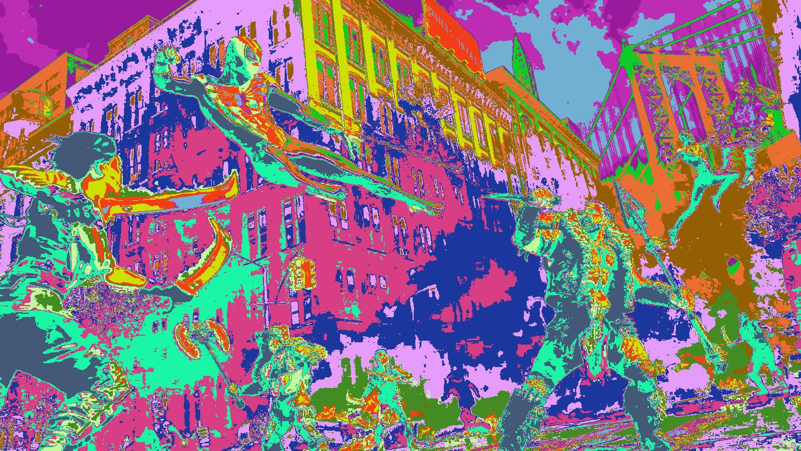

# Image Segmentation using K-Means Clustering

## Overview
This project demonstrates the implementation of the K-Means clustering algorithm for image segmentation. The algorithm segments an image into distinct regions based on color similarity.

## Example For K = 16



## Features
- Converts images from BGR to RGB format
- Reshapes images into 2D arrays of pixels
- Implements K-Means clustering algorithm from scratch using Numpy
- Segments images into a specified number of color clusters
- Displays the original and segmented images

## Requirements
- Python 3.x
- Numpy
- Matplotlib
- Pillow (PIL)

## Installation
```bash
pip install numpy matplotlib pillow
